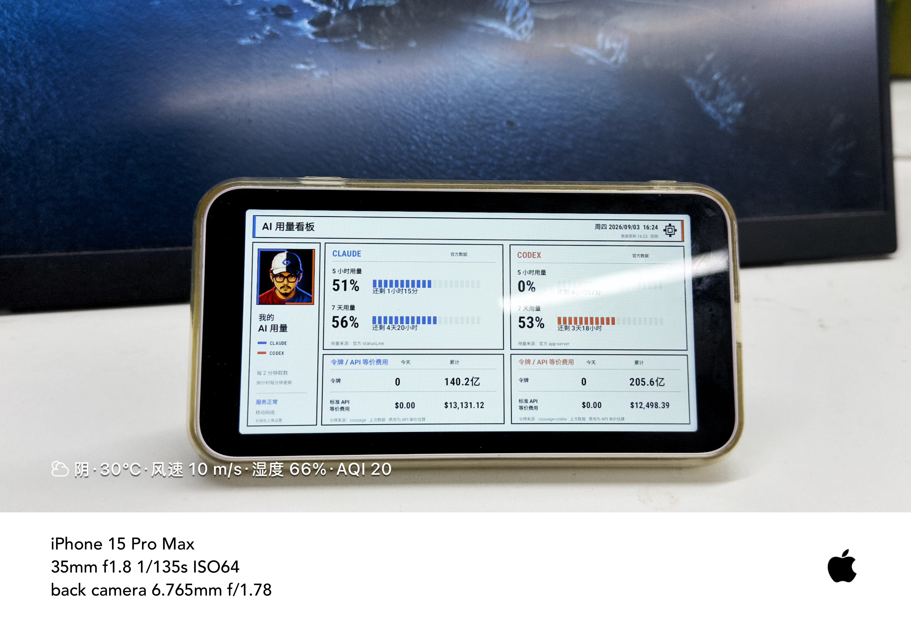

# UsageHub Open

UsageHub puts Claude and Codex quota, token usage, and API-equivalent cost on one dashboard.

<p align="center">
  
</p>

<p align="center">
  <strong>A glanceable, always-on AI usage dashboard for a real desk.</strong><br />
  <sub>Claude and Codex quota, reset time, local token history, and API-equivalent cost on Android or the web.</sub>
</p>

## Start here

Most people only need two actions.

### 1. Download the Android display

Download the signed Standard APK from the [latest release](https://github.com/cfrs2005/usagehub-open/releases/latest), install it, then pair it from `https://u.80aj.com`.

The Standard APK does not register as the system Home launcher. Kiosk mode remains an optional source build for managed devices.

### 2. Give one prompt to your local AI agent

1. Sign in at `https://u.80aj.com`.
2. Open **AI 接入**.
3. Name the computer and select **生成接入提示词**.
4. Copy the complete prompt to a trusted AI coding agent running on that computer.

The prompt contains a single-use enrollment code that expires after 10 minutes. The agent installs, configures, starts, and verifies the collector. A human does not need to understand the collector commands.

## What is public

- `android/`: Android dashboard application.
- `collectors/`: Claude, Codex, and local-cost collectors used by AI agents.
- `contracts/`: strict request schemas and validation utilities.
- `docs/`: public network and privacy contracts.
- `AGENTS.md`: the machine-readable onboarding procedure for coding agents.

The SaaS implementation, database, deployment files, OAuth configuration, and operational data are private and are not part of this repository.

## Privacy boundary

Collectors upload only allowlisted numeric usage fields and a generated installation ID. They never upload prompts, transcripts, account email addresses, working directories, cookies, OAuth credentials, or provider access tokens.

Claude quota comes only from the documented Claude Code `statusLine` input. Codex quota comes only from the local read-only app-server method. The project must not reuse provider credentials or call unpublished provider endpoints.

## For maintainers

Humans normally do not need to read the collector manual. AI agents and maintainers can use [collectors/README.md](collectors/README.md), [docs/ingest-api.md](docs/ingest-api.md), and [CONTRIBUTING.md](CONTRIBUTING.md).

```bash
npm ci
npm run check
```

Android checks are documented in [android/README.md](android/README.md).

## License

Apache-2.0. See [LICENSE](LICENSE).
